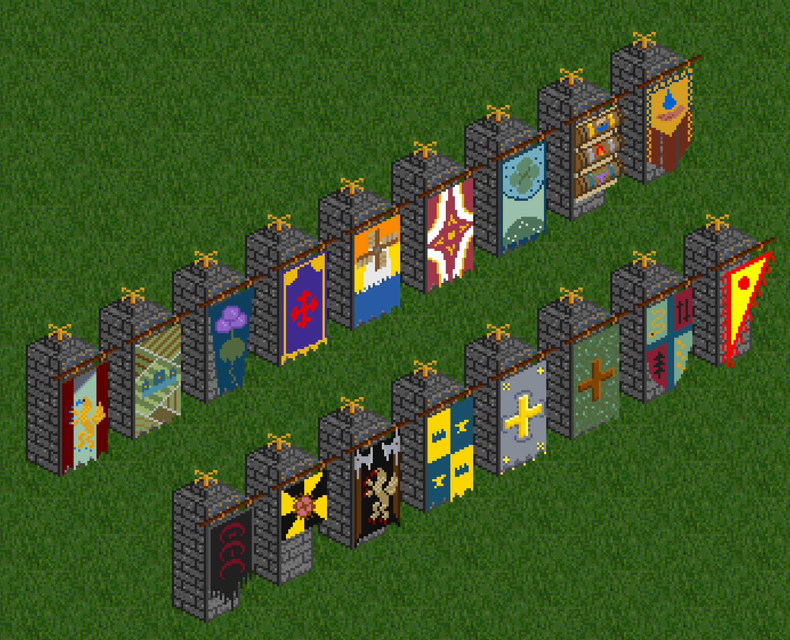

# Fantasy Banners - Objects

This is a small object set to add fantasy banners to OpenTTD of several nations loosely based off amalgamations of Middle Aged-Early Modern European and Asian countries. (And the Gnomish Haierarchy, which is an Anbennar item.)

The flags have a small wave animation that play every few seconds!

The original aseprite art files are included here, along with my hacky image magick script to generate the animations. (Though color corrections to the final frames are manually done in aseprite, since imagemagick doesn't support fixed palettes)

## How they look in-game

